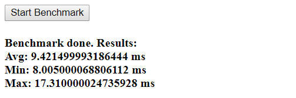
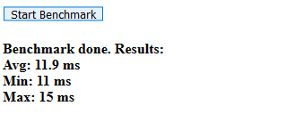

# Fibonacci Benchmark - JavaScript

## Run benchmark
```
npm install
npm run start
```
Go to http://localhost:8080 and click the `start` button.

## Benchmark
31.10.2019 - Chrome Browser (Version 78)



31.10.2019 - Firefox Browser (Version 70)



## Sources:
* [Project basis](https://github.com/rustwasm/wasm-pack-template)
* [Operations on arrays](https://codeburst.io/javascript-arrays-finding-the-minimum-maximum-sum-average-values-f02f1b0ce332)