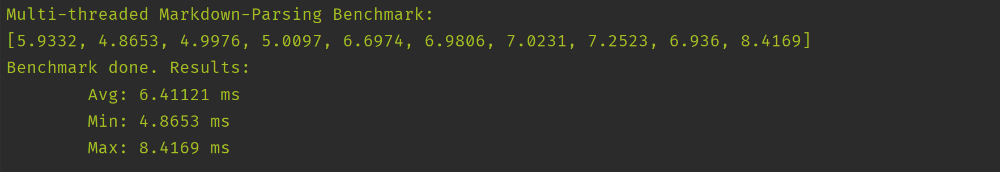

# Multi-threaded Markdown-Parsing Benchmark - Rust

## Run benchmark
```
cargo run --release
```

## Benchmark
03.11.2019 - Windows machine with Rust Nightly:



## Sources:
* [Compare floats](https://stackoverflow.com/a/53903615)
* [Measure time in Rust](https://stackoverflow.com/a/39696877)
* [Comrak Markdown-Parser](https://github.com/kivikakk/comrak)
* [Used Markdown File for testing](https://daringfireball.net/projects/markdown/syntax.text)