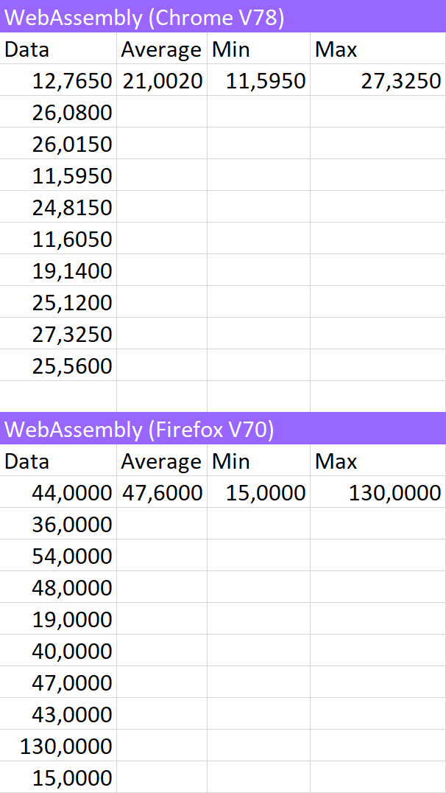

# Multi-threaded Markdown-Parsing Benchmark - WebAssembly

## Run benchmark
```
wasm-pack build --release --no-typescript
cd www
npm install
npm run start
```
Go to http://localhost:8080 and click the `start` button.

## Benchmark
03.11.2019 - Chrome (Version 78) & Firefox (Version 70)

Data in `ms`




## Sources:
* [Project basis](https://github.com/rustwasm/wasm-pack-template)
* [Comrak Markdown-Parser](https://github.com/kivikakk/comrak)
* [Used Markdown File for testing](https://daringfireball.net/projects/markdown/syntax.text)